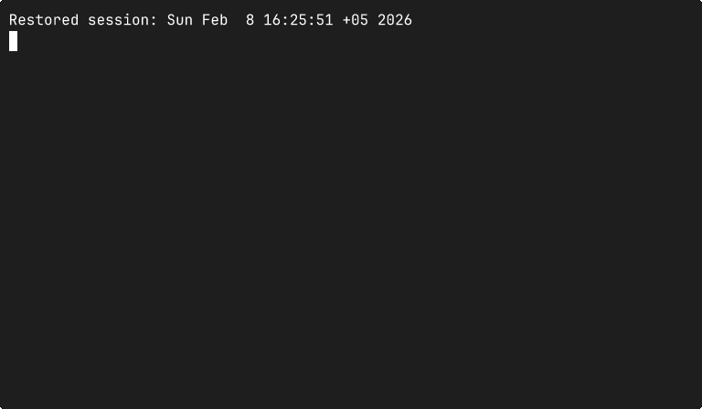

# Chatr

A package manager CLI for downloading, installing, and managing binary packages and macOS applications (casks).



## Installation

```bash
curl -sL https://raw.githubusercontent.com/teamcutter/chatr/main/install.sh | bash
```

## Usage

### Install a package

```bash
~/ chatr install hello
Downloading hello 100% |█████████████████████████████████████████████| (53/53 kB, 540 kB/s)

✓ hello@2.12.2
  cache: /Users/user/.chatr/cache/hello/2.12.2
  path: /Users/user/.chatr/packages/hello/2.12.2

~/ hello
Hello, world!
```

### Install a cask (macOS application)

```bash
~/ chatr install --cask firefox
Downloading firefox 100% |█████████████████████████████████████████████| (85/85 MB, 12 MB/s)

✓ firefox-147.0.3 (cask)
  app: /Applications/Firefox.app
```

## Commands

### install

Install one or more packages.

```bash
chatr install <name>...
```

| Flag | Short | Default | Description |
|------|-------|---------|-------------|
| `--cask` | | `false` | Install a macOS application (cask) |
| `--sha256` | | | Expected SHA256 checksum |

### remove

Remove one or more installed packages. Casks are detected automatically from state — no `--cask` flag needed.

```bash
chatr remove [name...]
```

| Flag | Short | Default | Description |
|------|-------|---------|-------------|
| `--version` | `-v` | `latest` | Package version to remove |
| `--all`| | `false` | Remove all installed packages |
### list

List all installed packages. Shows both formulae and casks.

```bash
chatr list
```

| Flag | Short | Default | Description |
|------|-------|---------|-------------|
| `--cask` | | `false` | List only casks |

### search

Search for packages in the registry.

```bash
chatr search <query>
```

| Flag | Short | Default | Description |
|------|-------|---------|-------------|
| `--cask` | | `false` | Search casks instead of formulae |
| `--show` | `-s` | `50` | Number of results to display |

### upgrade

Upgrade installed packages to the latest version. Automatically detects casks from state.

```bash
chatr upgrade [name...]
```

| Flag | Short | Default | Description |
|------|-------|---------|-------------|
| `--all` | | `false` | Upgrade all installed packages |

### clear

Clear the packages cache.

```bash
chatr clear
```

### version

Print the version of chatr.

```bash
chatr version
```

### new

Update chatr to the newest version.

```bash
chatr new
```

## Benchmarks

chatr vs Homebrew on macOS (Apple Silicon). Each test ran 3 times.

### Single install — `jq`

| | Cold cache | Warm cache |
|------|-----------|-----------|
| chatr | ~3.1s | ~0.8s |
| brew | ~11.9s | ~2.9s |
| **Speedup** | **~3.8x** | **~3.8x** |

### Multiple install — `jq tree wget ripgrep fd`

| | Cold cache | Warm cache |
|------|-----------|-----------|
| chatr | ~8.5s | ~3.4s |
| brew | ~13.9s | ~7.5s |
| **Speedup** | **~1.6x** | **~2.2x** |

### Cask install — `firefox`

| | Cold cache |
|------|-----------|
| chatr | ~19.3s |
| brew | ~29.5s |
| **Speedup** | **~1.5x** |

### Search — `json`

| | Cold cache | Warm cache |
|------|-----------|-----------|
| chatr | ~2.4s | ~0.16s |
| brew | ~3.3s | ~0.84s |
| **Speedup** | **~1.4x** | **~5.3x** |

## Build from Source

### Prerequisites

- Go 1.25 or later

### Build

```bash
git clone https://github.com/teamcutter/chatr.git
cd chatr
mkdir -p ~/.chatr/bin && go build -o ~/.chatr/bin/chatr ./cmd/chatr
```

Make sure that chatr bin directory is in your PATH, otherwise add it:

```bash
export PATH="$HOME/.chatr/bin:$PATH"
```

Add this line to your shell configuration file (`~/.bashrc`, `~/.zshrc`, etc.) to make it permanent.

## Registry

chatr uses the [Homebrew](https://brew.sh) formulae and cask registry as its package source. All packages and macOS applications are resolved and downloaded from the Homebrew API.

## Acknowledgements

Built with the following open source libraries:

- [cobra](https://github.com/spf13/cobra) — CLI framework
- [toml](https://github.com/BurntSushi/toml) — configuration parsing
- [color](https://github.com/fatih/color) — terminal colors
- [progressbar](https://github.com/schollz/progressbar) — download progress
- [compress](https://github.com/klauspost/compress) — zstd decompression
- [xz](https://github.com/ulikunitz/xz) — xz decompression

## License

Apache License 2.0
