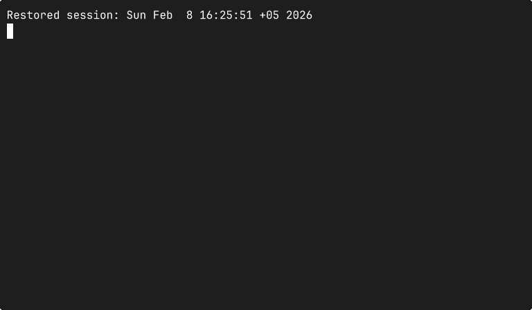

# Chatr

A package manager CLI for downloading, installing, and managing binary packages and macOS applications (casks).



## Installation

```bash
curl -sL https://raw.githubusercontent.com/teamcutter/chatr/main/install.sh | bash
```

chatr and the packages it installs live under `/opt/chatr`, which the script creates once with `sudo`. Then add chatr to your shell, for zsh in `~/.zprofile`:

```bash
eval "$(/opt/chatr/bin/chatr shellenv)"
```

For bash use `~/.bash_profile` on macOS or `~/.bashrc` on Linux. For fish, add `/opt/chatr/bin/chatr shellenv fish | source` to `~/.config/fish/config.fish`. The script prints the right line for your shell.

### Why /opt/chatr

Homebrew bottles are compiled for `/opt/homebrew` on Apple Silicon, `/usr/local` on Intel and `/home/linuxbrew/.linuxbrew` on Linux, and those paths are baked into the binaries. chatr rewrites them in place, which only works when the new prefix is no longer than the original. `/opt/chatr` fits on every platform, so the prefix is fixed and not a setting.

### Moving to /opt/chatr

Installs made before `/opt/chatr` keep using `~/.chatr`, because their packages were relocated for that path. On macOS, tools that locate their own files at runtime, such as Python, git or OpenSSL, can break there, and chatr prints a warning on install and upgrade. To move:

```bash
chatr list                       # note what you have installed
chatr remove --all
sudo mkdir -p /opt/chatr && sudo chown $(whoami) /opt/chatr
```

Then delete the `bin_dir`, `lib_dir`, `cellar_dir`, `opt_dir`, `include_dir`, `share_dir`, `etc_dir`, `var_dir` and `frameworks_dir` lines from `~/.chatr/config.toml`. They are no longer settings, and chatr only reads `cellar_dir` to recognize the old layout. Replace the PATH line in your shell config with the `eval "$(chatr shellenv)"` line above, open a new terminal and reinstall your packages.

## Usage

### Install a package

```bash
~/ chatr install hello
Downloading hello 100% |█████████████████████████████████████████████| (53/53 kB, 540 kB/s)

✓ hello-2.12.2
  cellar: /opt/chatr/Cellar/hello/2.12.2
  opt: /opt/chatr/opt/hello

~/ hello
Hello, world!
```

### Install a cask (macOS application)

```bash
~/ chatr install --cask firefox
Downloading firefox 100% |█████████████████████████████████████████████| (85/85 MB, 12 MB/s)

✓ firefox-147.0.3 (cask)
  app: /Applications/Firefox.app
```

## Commands

### install

Install one or more packages.

```bash
chatr install <name>...
```

| Flag | Short | Default | Description |
|------|-------|---------|-------------|
| `--cask` | | `false` | Install a macOS application (cask) |
| `--sha256` | | | Expected SHA256 checksum |

### remove

Remove one or more installed packages. Casks are detected automatically from state — no `--cask` flag needed.

```bash
chatr remove [name...]
```

| Flag | Short | Default | Description |
|------|-------|---------|-------------|
| `--version` | `-v` | `latest` | Package version to remove |
| `--all`| | `false` | Remove all installed packages |
### list

List all installed packages. Shows both formulae and casks.

```bash
chatr list
```

| Flag | Short | Default | Description |
|------|-------|---------|-------------|
| `--cask` | | `false` | List only casks |

### search

Search for packages in the registry.

```bash
chatr search <query>
```

| Flag | Short | Default | Description |
|------|-------|---------|-------------|
| `--cask` | | `false` | Search casks instead of formulae |
| `--show` | `-s` | `50` | Number of results to display |

### upgrade

Upgrade installed packages to the latest version. Automatically detects casks from state.

```bash
chatr upgrade [name...]
```

| Flag | Short | Default | Description |
|------|-------|---------|-------------|
| `--all` | | `false` | Upgrade all installed packages |

### tldr

Show package summary and manual.

```bash
chatr tldr jq
```

| Flag | Short | Default | Description |
|------|-------|---------|-------------|
| `--cask` | | `false` | Show cask info |

### clear

Clear the packages cache.

```bash
chatr clear
```

### version

Print the version of chatr.

```bash
chatr version
```

### new

Update chatr to the newest version.

```bash
chatr new
```

### shellenv

Print shell code that puts chatr and its packages on `PATH`, `MANPATH` and `INFOPATH`. The shell is detected from `$SHELL` unless one is given. Evaluating it more than once is harmless.

```bash
chatr shellenv [sh|bash|zsh|fish]
```

## Benchmarks

chatr vs Homebrew on macOS (Apple Silicon). Measured with [hyperfine](https://github.com/sharkdp/hyperfine), 3 runs each.

### Single install — `jq`

| | Cold cache | Warm cache |
|------|-----------|-----------|
| chatr | ~1.5s | ~303ms |
| brew | ~12.1s | ~3.1s |
| **Speedup** | **~8x** | **~10.2x** |

### Multiple install — `jq tree wget ripgrep fd`

| | Cold cache | Warm cache |
|------|-----------|-----------|
| chatr | ~11.1s | ~2.8s |
| brew | ~82.4s | ~7.9s |
| **Speedup** | **~7.5x** | **~2.9x** |

### Cask install — `firefox`

| | Cold cache |
|------|-----------|
| chatr | ~25.8s |
| brew | ~107.6s |
| **Speedup** | **~4.2x** |

### Search — `json`

| | Cold cache | Warm cache |
|------|-----------|-----------|
| chatr | ~170ms | ~165ms |
| brew | ~897ms | ~876ms |
| **Speedup** | **~5.3x** | **~5.3x** |

## Build from Source

### Prerequisites

- Go 1.26 or later

### Build

```bash
git clone https://github.com/teamcutter/chatr.git
cd chatr
sudo mkdir -p /opt/chatr && sudo chown $(whoami) /opt/chatr
mkdir -p /opt/chatr/bin && go build -o /opt/chatr/bin/chatr ./cmd/chatr
```

Then add chatr to your shell as described in [Installation](#installation).

## Registry

chatr uses the [Homebrew](https://brew.sh) formulae and cask registry as its package source. All packages and macOS applications are resolved and downloaded from the Homebrew API.

## Acknowledgements

Built with the following open source libraries:

- [cobra](https://github.com/spf13/cobra) — CLI framework
- [toml](https://github.com/BurntSushi/toml) — configuration parsing
- [color](https://github.com/fatih/color) — terminal colors
- [progressbar](https://github.com/schollz/progressbar) — download progress
- [compress](https://github.com/klauspost/compress) — zstd decompression
- [xz](https://github.com/ulikunitz/xz) — xz decompression

## License

Apache License 2.0
